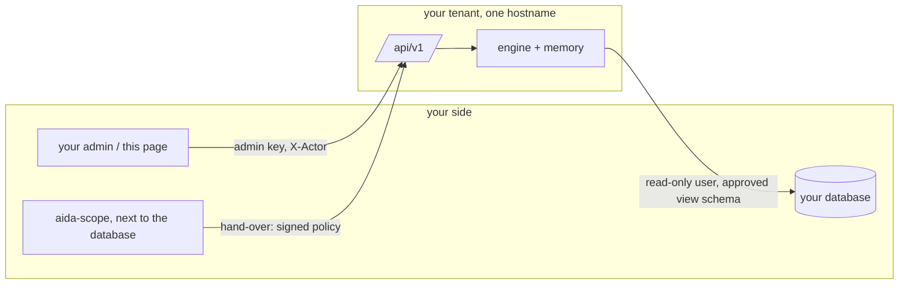
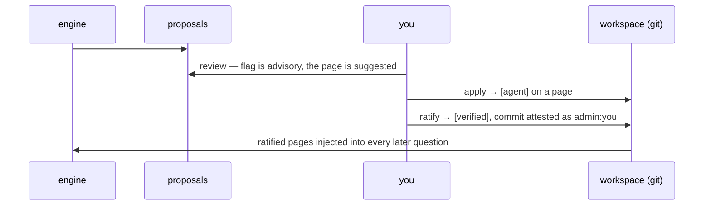

# aida desk

Your tenant's page, and the reference client for its API. Served by your
own tenant at `https://<client>.aida.simtree.ai/`; this repository holds
its source and the API specification, so an integration into your own
admin makes exactly the calls this page makes.

## Sign in

The admin key your operator gave you, and your name. The key is one per
tenant; your name is recorded on every action you take, as
`admin:<name>`, and is the attesting identity when you ratify memory.
Both stay in the browser tab.

## What is on the page

- **Ask**: a conversation with the engine over your data. Answers arrive
  as the engine works; a report opens as a link.
- **Memory**: what the engine learned about the *shape* of your data,
  never a value. Proposals wait for your review with an advisory
  `content?` flag from a reader and the page the judge suggests. Apply
  files a proposal as unverified; drop discards it. A page's unverified
  entries are reviewed with their evidence, then ratified, which marks
  them verified and commits them in your workspace under your name.
  Audit lists what a reader still flags; contradictions runs a judge over
  the whole corpus and lists pairs that cannot both be followed.
- **Status**: the workspace's git state and what awaits ratification.

## The API

Every route is under `/api/v1/` on your tenant's hostname, with two
headers: `Authorization: Bearer <admin key>` and `X-Actor: <name>`.

| | |
|---|---|
| `GET  /api/v1/admin/whoami` | who the key and name resolve to |
| `GET  /api/v1/admin/memory` | proposals with flag and page; the pages |
| `POST /api/v1/admin/memory/apply` `{ids, page?}` | file proposals; a refused id names the token |
| `POST /api/v1/admin/memory/drop` `{ids}` | discard proposals |
| `POST /api/v1/admin/memory/add` `{text, page?}` | file a fact you know, as verified |
| `GET  /api/v1/admin/memory/pages/{page}/review` | the page's unverified entries with evidence |
| `POST /api/v1/admin/memory/pages/{page}/ratify` | mark verified and commit, attested as you |
| `GET  /api/v1/admin/memory/history` | past ratifications |
| `GET  /api/v1/admin/memory/audit` | entries a reader flags; `pii` is the tier that matters |
| `POST /api/v1/admin/memory/contradictions` | a judge run over the corpus; minutes |
| `GET  /api/v1/status` | workspace state |
| `POST /api/v1/conversations/{uid}/messages` `{text, actor, client_msg_id}` | ask |
| `GET  /api/v1/conversations/{uid}/events?after=&epoch=&wait_s=` | the answers, long-polled |

The full document is `openapi.json` here and at `/api/v1/openapi.json`
on your tenant, with interactive docs at `/api/v1/docs`.

## How it fits

## Sources

The database itself is scoped on your side with
[aida-scope](https://github.com/vanderian/aida-scope): read the
structure, draft a mask per role, sign, have your DBA run the emitted
SQL, verify, and hand over the bundle. The engine reaches the approved
view schema and nothing else.
