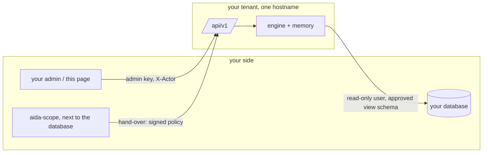
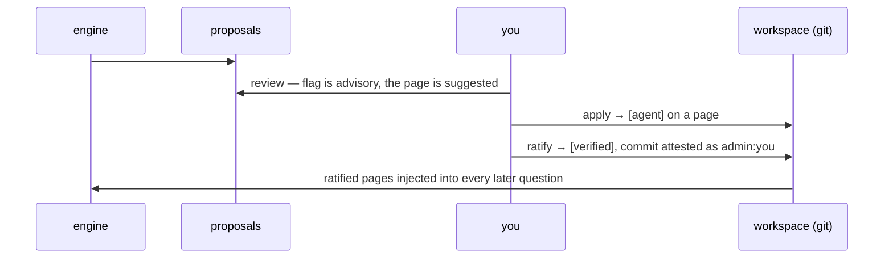

# aida desk

Your tenant's page, and the reference client for its API. Served by your
own tenant at `https://<client>.aida.simtree.ai/`; this repository holds
its source and the API specification, so an integration into your own
admin makes exactly the calls this page makes.

## Sign in

The admin key your operator gave you, and your name. The key is one per
tenant; your name is recorded on every action you take, as
`admin:<name>`, and is the attesting identity when you ratify memory.
Both stay in the browser tab.

## What is on the page

- **Ask**: your questions as threads. A new question opens a thread;
  the answer comes with its report as a button and the engine's
  suggested follow-ups as the questions they are. A follow-up, clicked or
  typed at the bottom, stays in its thread. One question at a time per
  thread, and a cap on unanswered questions per conversation, enforced by
  the tenant, so a page cannot flood the engine.
- **Research**: a deeper run in several passes, with the number of passes
  chosen up to the deployment's limit. It opens a thread like any question.
- **History**: your past questions from the labor ledger, each opening
  the answer as the engine wrote it.
- **Memory**: what the engine learned about the *shape* of your data,
  never a value. Proposals wait for your review with an advisory
  `content?` flag from a reader and the page the judge suggests. Apply
  files a proposal as unverified; drop discards it. A page's unverified
  entries are reviewed with their evidence, then ratified, which marks
  them verified and commits them in your workspace under your name.
  Audit lists what a reader still flags; contradictions runs a judge over
  the whole corpus and lists pairs that cannot both be followed.
- **Monitoring**: your tenant's own numbers, the same collection our
  operators see for it: runs, failures, latency, tokens and cost by
  window, day, model and channel; the recent runs with their questions;
  incidents; what is in flight; memory and sources as structure; the
  workspace's git state; and the operator's trail on your tenant, every
  time simtree read your rows, with the reason given.
- **Settings**: your own integrations. Create one and get its key, once;
  it authenticates on the next request, no restart; revoke to rotate.
  Then allow `web:<name>` on the sources it may use. What channels run
  on the tenant is the operator's; the admin key is issued by them.
- **Status**: the workspace's git state and what awaits ratification.

## The API

Every route is under `/api/v1/` on your tenant's hostname, with two
headers: `Authorization: Bearer <admin key>` and `X-Actor: <name>`.

| | |
|---|---|
| `GET  /api/v1/admin/whoami` | who the key and name resolve to |
| `GET  /api/v1/admin/memory` | proposals with flag and page; the pages |
| `POST /api/v1/admin/memory/apply` `{ids, page?}` | file proposals; a refused id names the token |
| `POST /api/v1/admin/memory/drop` `{ids}` | discard proposals |
| `POST /api/v1/admin/memory/add` `{text, page?}` | file a fact you know, as verified |
| `GET  /api/v1/admin/memory/pages/{page}/review` | the page's unverified entries with evidence |
| `POST /api/v1/admin/memory/pages/{page}/ratify` | mark verified and commit, attested as you |
| `GET  /api/v1/admin/memory/history` | past ratifications |
| `GET  /api/v1/admin/memory/audit` | entries a reader flags; `pii` is the tier that matters |
| `POST /api/v1/admin/memory/contradictions` | a judge run over the corpus; minutes |
| `GET  /api/v1/admin/status` | workspace state |
| `GET  /api/v1/admin/integrations` | your integrations, and the provisioned ones |
| `POST /api/v1/admin/integrations` `{name}` | mint one; the key comes back once |
| `DELETE /api/v1/admin/integrations/{name}` | revoke it |
| `GET  /api/v1/admin/monitor?days=` | the tenant's collection: summary, incidents, in flight, memory, git, sources, the operator's trail |
| `GET  /api/v1/admin/monitor/rows?days=&limit=&what=` | the rows behind it: runs, incidents, in flight |
| `POST /api/v1/conversations/{uid}/messages` `{text, actor, client_msg_id, thread_ref?, mode?, loop?}` | ask; `thread_ref` continues a thread, `mode: dig` with `loop` is research. 409 when the thread has a question in flight, 429 at the conversation's cap. No commands: a slash or a prefix is refused |
| `GET  /api/v1/conversations/{uid}/inflight` | what is running now, and the limits |
| `GET  /api/v1/admin/captures/{path}` | one of your captures, for history |
| `GET  /api/v1/conversations/{uid}/events?after=&epoch=&wait_s=` | the answers, long-polled |

A wrong key is counted per client address: past the tenant's limit, ten
in ten minutes by default, every request from that address is refused
with 429 until the window passes, right key or not.

The full document is `openapi.json` here and at `/api/v1/openapi.json`
on your tenant, with interactive docs at `/api/v1/docs`.

## How it fits

## Sources

The database itself is scoped on your side with
[aida-scope](https://github.com/vanderian/aida-scope): read the
structure, draft a mask per role, sign, have your DBA run the emitted
SQL, verify, and download the hand-over bundle. Then, on this page:

1. **Register** the bundle with the host and port the engine connects
   to, and the channels that may use the source, one of your
   integrations, the desk, the chat.
2. **Store the password** of the engine's user. It goes into your
   workspace's environment on the tenant, never in git and never shown
   again; the engine reads it on every run.
3. **Verify**: seven checks as the engine's user from the tenant. The
   source is offered only while the verification passes for the policy
   file as it is.

The engine reaches the approved view schema and nothing else; a
different mask for another role is simply another source.

| | |
|---|---|
| `GET  /api/v1/admin/channels` | the channels a source can be offered to on this tenant |
| `GET  /api/v1/admin/sources` | every source and whether the engine offers it |
| `POST /api/v1/admin/sources` `{name, host, port, zip, callers}` | register from the hand-over (zip as base64) |
| `POST /api/v1/admin/sources/{name}/secret` `{password}` | the engine user's password, into the workspace env |
| `PUT  /api/v1/admin/sources/{name}/callers` `{callers}` | who may use it |
| `POST /api/v1/admin/sources/{name}/verify` | prove it; the report comes back, pass or fail |
